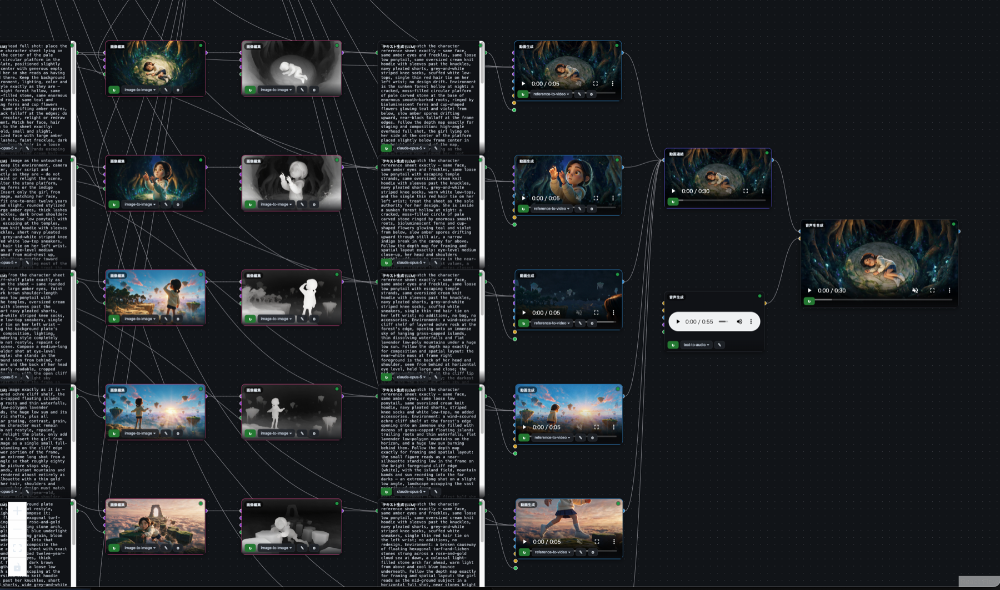

# Creative Canvas for Pika API Club

> **Unofficial.** This is a personal project. It is not affiliated with, endorsed by, or
> sponsored by Pika. "Pika" and "Pika API Club" are used only to say which API this app
> talks to. Your use of that API is governed by Pika's own terms, and everything you
> generate is billed to your own Pika account.

English | [日本語](README.ja.md)



A node-based canvas for image, video, audio and text generation, running as a desktop app.
Every generation goes through the **Pika API**, so **one API key** reaches the whole catalog,
and a built-in **MCP server** lets **Claude Code** build the graph and run it for you.

- Electron desktop app: bundled server + a React canvas
- Ships an MCP server, so an agent can add nodes, wire them and generate
- Everything you make stays **on your machine** — nothing is uploaded to this project

The UI is in Japanese. The model catalog, prompts and this README are in English.

---

## Why this exists

Most multi-provider canvases carry a hand-written adapter per model: a file that names the
parameters, guesses the defaults and hard-codes the price. It rots the day a provider ships
a new endpoint.

Pika publishes the JSON Schema **and** the price tiers for every endpoint it serves, so this
app has **no hand-written model definitions at all**. The model layer is generated from the
catalog (`npm run sync:catalog`); adding a model means re-running the sync, not writing code.
The only hand-maintained piece is a small table mapping media field names to canvas ports.

That is also why the node list is short. `video_gen` covers text-to-video, image-to-video,
first-last-frame, reference-to-video, video-to-video, extension, motion control and avatar —
one node type, because the model's own schema decides which ports it needs.

---

## Requirements

- **Node.js 18+** (LTS recommended) — https://nodejs.org
- **git**
- A **Pika API key** — issue one at https://dev.pika.art
  - One key covers image, video, audio and LLM models. You are billed for successful
    generations only.
  - No key? `MOCK_PROVIDER=1` runs the whole app against placeholder output, free.
- **ffmpeg / ffprobe** — for the local nodes (concat, trim, frame extract, audio mux).
  - macOS: `brew install ffmpeg`
  - Windows: `winget install Gyan.FFmpeg` in PowerShell (then restart the app)
- **Claude Code** — optional, but it is how the MCP half is meant to be driven.

Runs on **macOS (Apple Silicon)** and **Windows 10 / 11 (x64)**. The Windows build and a smoke
test of it (`desktop/smoke.mjs`) run on a GitHub Actions Windows runner
(`.github/workflows/windows.yml`).

---

## Install

```bash
git clone https://github.com/yzrkbys/creative-canvas-for-pika.git
cd creative-canvas-for-pika
npm install
npm run app
```

`npm run app` builds the web bundle and the server, then launches the desktop app. On Windows,
run the same commands in PowerShell or the Command Prompt.

**Set your API key** from the app's menu: **Canvas → 設定（APIキー）を開く**. Paste
`PIKA_API_KEY=...` into the file that opens (Notepad, on Windows), save, and choose
**Canvas → 設定を反映して再起動** (apply and restart). The key lives in your user data directory,
never in the repository.

### Packaging a Windows installer

```bash
npm run app:dist:win    # → desktop/release/CreativeCanvasForPika-Setup-<version>.exe
```

Build it on Windows, or cross-build it from macOS (the first run downloads Electron for Windows
and NSIS). The installer installs per user, so it needs no admin rights, and uninstalling keeps
your work in `%APPDATA%`.

The build is **unsigned**, so SmartScreen will say "Windows protected your PC" on first launch.
Choose **More info → Run anyway**. Making that go away takes a code-signing certificate.

### Packaging a `.app` (macOS)

```bash
npm run app:dist        # → desktop/release/
```

The build is **unsigned**, so macOS will refuse to open it on the first try
("damaged / cannot be opened"). Either right-click the app and choose **Open**, or clear
the quarantine flag:

```bash
xattr -dr com.apple.quarantine "/Applications/Creative Canvas for Pika API Club.app"
```

Signing it yourself requires an Apple Developer ID.

---

## Driving it from Claude Code

Open this folder in Claude Code. The bundled `.mcp.json` registers an MCP server named
**`creative-canvas-pika`** (deliberately not `creative-canvas`, so it can coexist with other
canvases you may have registered). Start the desktop app first — the MCP server talks to it
over `127.0.0.1:8797` — then just ask. The MCP server is launched with `node` directly rather
than through `npx`, so it needs no `cmd /c` wrapper on Windows.

- "Make an image node for a sunset over Mount Fuji and generate it"
- "Turn that image into a 5-second clip"
- "Score this cut and mux the music back onto the picture"

Nodes appear on the canvas as they are created, live.

---

## Node types

| Group | Nodes | In → out |
|---|---|---|
| Image | `image_gen` · `image_edit` · `image_upload` | text, image → image |
| Video | `video_gen` · `video_upscale` · `video_trim` · `video_concat` · `frame_extract` · `video_upload` | text, image, video, audio → video |
| Audio | `audio_gen` · `video_to_audio` · `av_mux` · `transcribe` · `audio_upload` | text, audio, video → audio (`transcribe` → text) |
| Text | `llm_text` · `note` · `doc` · `web_clip` · `file_import` | text → text |
| Layout | `frame` | a visual grouping box |

The ffmpeg-backed nodes (`video_trim`, `video_concat`, `frame_extract`, `av_mux`) and
`web_clip` run locally and cost nothing. `video_concat` defaults to a local ffmpeg join, which
keeps the picture only; switch its model to **Pika Video Merge** (2–10 clips, $0.0002/s) to keep
each clip's audio. Either way the clips play left to right as laid out on the canvas.

The **scoring round trip** closes inside the canvas:
`video_gen → video_to_audio` (score the cut) `→ av_mux` (put the track back on the picture).

### Checking a job while it runs

A generating node's settings panel stays reachable — through **設定** or **内容を確認** on the
node. Its first section shows what the running job was actually sent:

- the model, the prompt (marked when it came from an upstream text node), the parameters and
  thumbnails of the wired inputs
- elapsed time, the estimate, and the **Pika job id** (copyable — for looking the job up on
  Pika's side, and for finalising drafts, below)

A job is **frozen at start**: editing the prompt or switching the model while it runs changes
the next run, not this one. Every output also records what made it, so when a re-run sends the
previous result to the archive, that result keeps the model and prompt that produced it.

**Seedance 2.5 drafts**: turn `draft` on to get a 480p preview first. To finalise it, paste its
job id into *Draft Job Id* on "Seedance 2.5 Draft To Video" for a 1080p render that inherits the
draft's prompt and inputs (within 7 days; the final is billed as its own job).

---

## How the model registry works

Pika serves the schema and pricing for every endpoint at `GET /catalog/apis` and
`GET /catalog/apis/{api_id}?expand=inputs`. The sync turns that into
`server/src/pika-catalog.json`:

```bash
npm run sync:catalog
# early-access models are gated: PIKA_API_KEY=... npm run sync:catalog
```

From the schema it derives:

- **Parameter widgets** — enums become selects, integers become number inputs, and composite
  types like `anyOf:[integer 4-15, "auto"]` expand into a single list of choices.
- **Defaults** — only the ones the schema actually declares. Where none is declared the field
  is shown as "model default" and **simply not sent**. Picking the first enum value instead
  would silently pin models to 480p or 1:1 without anyone choosing that.
- **Port wiring** — the `media_kinds` annotation says which fields take images, video or audio.
- **Cost** — the price tier whose `spec` matches the node's parameters.

The sync **fails loudly** if the catalog grows a media field it has no port for, rather than
quietly dropping an input and billing you for the result.

To pick up new models without rebuilding the app, drop the generated `pika-catalog.json` into
your user data directory (see below) and restart; it takes precedence over the bundled copy.

### What the cost figure means

Billing units differ per model, and some genuinely cannot be quoted in advance:

| Unit | Examples | Quotable up front |
|---|---|---|
| second | Kling, Veo, Wan | yes — rate × duration |
| image | Seedream, GPT-Image | yes — rate × count |
| character | ElevenLabs TTS | yes — rate × prompt length |
| request | some models | yes — flat |
| minute | Sonilo scoring | partly — scales with the input clip |
| token | Seedance, Gemini Omni, LLMs | **no** — output volume is unknown until it exists |

Token-billed models say "cannot be estimated" and ask for confirmation rather than inventing
a number. **`$0` means "not quotable", not "free".**

---

## Guards that run before you are billed

Wiring mistakes are caught locally, **before anything is uploaded or submitted**:

- a required media input is not connected
- media is connected to a port the model never reads (a reference image on a t2i model)
- several connections into a single-value field, or past an array's limit
- a prompt over the model's character limit
- structured parameters (ElevenLabs dialogue, Kling omni-video) left unset

Each error names the port to disconnect or the one to use instead.

---

## Where your data lives

- macOS: `~/Library/Application Support/Creative Canvas for Pika API Club/`
- Windows: `%APPDATA%\Creative Canvas for Pika API Club\`

Projects, generated media, and your `.env` (with the API key) are all there, and none of it is
in the repository. Open it from the menu: **Canvas → 保存フォルダを開く**.

> Upgrading from the old name: this app was called *Pika Canvas* until 2026-09-02. On first
> launch it moves the old `Pika Canvas` folder to the new name, so existing projects follow
> the app. If the move fails it keeps using the old folder and says so in the log — your work
> is never left behind.

---

## Troubleshooting

**The app opens to an empty window / "server not connected".**
The bundled server failed to start. Launch from a terminal (`npm run app`) to see its log.
The usual cause is port `8797` already being in use; the app falls back to a free port and
writes it to `server-port` in the data directory.

**A generation fails with `file too large`.**
Pika rejects uploads over **100 MiB** (104,857,600 bytes exactly), and the rejection happens
before any bytes are sent. Generated clips reach that easily — a 30-second 1080p clip can be
over 200 MiB.

Where the model only *analyses* the clip and returns something else — scoring, transcription —
the app re-encodes an oversized video down to fit automatically, capped at 720p with the audio
stream copied untouched, and logs that it did. Where the input's pixels carry into the output —
video-to-video, extension, upscale — it refuses instead, because quietly downscaling your master
is a worse failure than stopping: you would never see it happen. Trim the clip with `video_trim`,
or import a smaller re-encode.

**A video job seems stuck for half an hour.**
Some models genuinely take that long; a 30-second clip from an early-access model has been
measured at 44–55 minutes. The app polls for up to 180 minutes. Giving up earlier would
orphan a job that Pika keeps running — and keeps billing.

**`ffmpeg failed` / `ffmpeg の起動に失敗しました`.**
ffmpeg was not found. Besides `PATH`, the app looks in Homebrew's locations (macOS) and in
winget / scoop / Chocolatey / `C:\ffmpeg\bin` (Windows). Restart the app if you just installed
it; otherwise set `PIKA_CANVAS_FFMPEG` and `PIKA_CANVAS_FFPROBE` in the settings file
(e.g. `PIKA_CANVAS_FFMPEG=C:\ffmpeg\bin\ffmpeg.exe`).

**A model shows ⚠ / "現在の Pika カタログにありません" (no longer in the catalog).**
Pika has retired it (the 2026-10 sync dropped `deepseek-v4-flash` and the `eleven-music` sound
effects). Pick another model in the node's settings. The run stops before billing, so nothing
was charged.

**Connecting the MCP server from somewhere else (e.g. WSL2).**
The bundled server listens on `127.0.0.1` only — it fronts a paid API, so it stays off the LAN,
and Windows raises no firewall prompt. If you really need outside access, put
`PIKA_CANVAS_HOST=0.0.0.0` in the settings file and restart.

**A model you can see on Pika's site is missing from the list.**
Re-run the sync with your key (`PIKA_API_KEY=... npm run sync:catalog`); early-access models
are only visible to allowlisted keys. A few catalog rows are vendor aliases that declare no
function — those are skipped on purpose, and their real endpoints are already in the list.

---

## Development

```bash
npm run dev          # server on :8797 + Vite on :5173
npm run typecheck    # server, mcp and web
```

Layout: `server/` (Express + WebSocket API) · `web/` (React + React Flow) · `mcp/` (stdio MCP
→ HTTP) · `desktop/` (Electron shell).

To try something without disturbing a running app, start a second server on its own port and
its own data directory:

```bash
PORT=8891 PIKA_CANVAS_DATA_DIR=/tmp/canvas-dev node_modules/.bin/tsx server/src/index.ts
```

On Windows (PowerShell):

```powershell
$env:PORT=8891; $env:PIKA_CANVAS_DATA_DIR="$env:TEMP\canvas-dev"; node node_modules/tsx/dist/cli.mjs server/src/index.ts
```

Add `MOCK_PROVIDER=1` to run without billing, and `MOCK_LATENCY_MS=20000` to watch the
in-progress UI at leisure. The server bundle the app ships can be exercised end to end in mock
mode (a generation and an ffmpeg concat) with
`npm -w desktop run build:all && npm -w desktop run smoke`.

---

## License

MIT — see [LICENSE](LICENSE).

The MIT license covers this source code only. It grants no rights in Pika's API, service or
trademarks. Using the Pika API is subject to Pika's terms, and the rights to and the cost of
anything you generate are between you and Pika.
